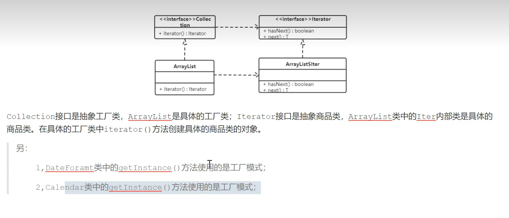

# 缓存

图片来源 [Bilibili 黑马教程]<https://www.bilibili.com/video/BV1cr4y1671t?p=35&vd_source=6d69743f14f25912f>

**优点**
1、提高性能：缓存可以显著减少数据访问的时间，提高系统的响应速度。

2、减轻数据库负载：通过缓存频繁访问的数据，可以减少对数据库的直接访问，减轻数据库的负载。

3、提高可扩展性：缓存可以帮助系统在高并发情况下保持稳定的性能。

**缺点**

1、数据一致性问题：缓存中的数据可能与数据库中的数据不一致，需要额外的机制来保持一致性。

2、缓存失效：缓存数据有过期时间，过期后需要重新加载，可能会导致短暂的性能下降。

3、内存消耗：缓存需要占用额外的内存资源，可能会影响系统的内存使用情况。

# java继承

在java中，类是单继承制，一个类只能有一个父类，关键词为extends,
接口是多继承制，一个接口可以继承多个接口，关键词为extends

# 设计模式
**开闭原则**

**应用实例：**
    
    spring框架中使用了简单工厂加配置文件的方式解除工厂对象和产品对象的耦合
   
    使用迭代器遍历集合,获取集合中的元素。而单列集合获取迭代器的方法就使用到了工厂方法模式。

图片来源 [黑马教程](https://www.bilibili.com/video/BV1Np4y1z7BU?p=45&vd_source=6d69743f14f25912fdea2053293a8f2f)